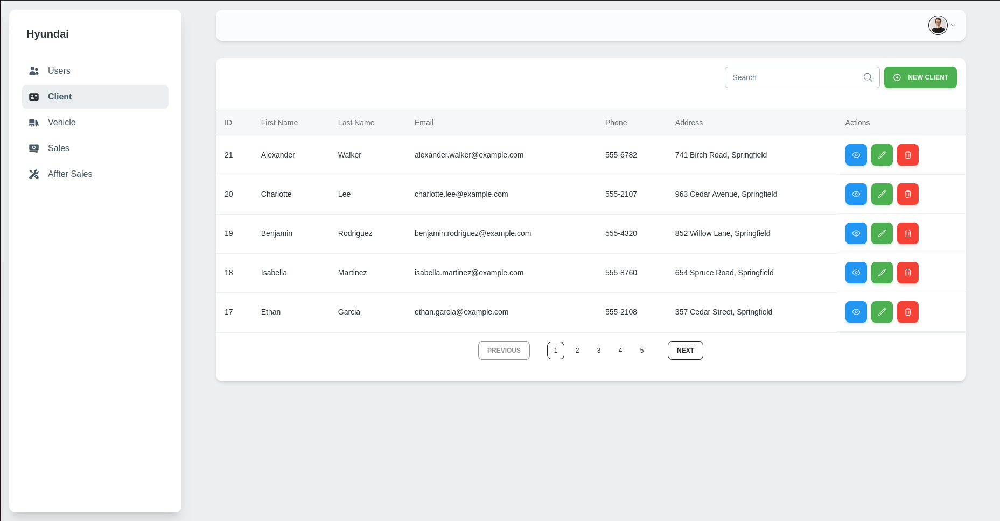

# Hyundai Sales Management System

## Table of Contents

1. [Overview](https://www.notion.so/README-103c09d1747f80ae8003d44dcc2fbe75?pvs=21)
2. [Features](https://www.notion.so/README-103c09d1747f80ae8003d44dcc2fbe75?pvs=21)
3. [Technologies Used](https://www.notion.so/README-103c09d1747f80ae8003d44dcc2fbe75?pvs=21)
4. [Installation](https://www.notion.so/README-103c09d1747f80ae8003d44dcc2fbe75?pvs=21)
   * [Prerequisites](https://www.notion.so/README-103c09d1747f80ae8003d44dcc2fbe75?pvs=21)
   * [Cloning the Repository](https://www.notion.so/README-103c09d1747f80ae8003d44dcc2fbe75?pvs=21)
   * [Setting Up the Backend](https://www.notion.so/README-103c09d1747f80ae8003d44dcc2fbe75?pvs=21)
   * [Setting Up the Frontend](https://www.notion.so/README-103c09d1747f80ae8003d44dcc2fbe75?pvs=21)
   * [Docker Setup](https://www.notion.so/README-103c09d1747f80ae8003d44dcc2fbe75?pvs=21)
5. [Usage](https://www.notion.so/README-103c09d1747f80ae8003d44dcc2fbe75?pvs=21)
   * [Access the Application](https://www.notion.so/README-103c09d1747f80ae8003d44dcc2fbe75?pvs=21)
   * [API Endpoints](https://www.notion.so/README-103c09d1747f80ae8003d44dcc2fbe75?pvs=21)
6. [Testing](https://www.notion.so/README-103c09d1747f80ae8003d44dcc2fbe75?pvs=21)
7. [Contributing](https://www.notion.so/README-103c09d1747f80ae8003d44dcc2fbe75?pvs=21)
8. [License](https://www.notion.so/README-103c09d1747f80ae8003d44dcc2fbe75?pvs=21)
9. [Contact](https://www.notion.so/README-103c09d1747f80ae8003d44dcc2fbe75?pvs=21)

## Overview

**Hyundai Sales Management System** is a comprehensive solution designed to streamline Hyundai vehicle sales and after-sales processes. The application facilitates efficient management of clients, vehicles, sales, and after-sales services. Built with a modern tech stack, this project integrates a Next.js frontend, a Spring Boot backend, and a MySQL database, all managed and deployed using Docker.



## Features

* **Client Management**: Add, update, and manage client information.
* **Vehicle Management**: Track and manage vehicle inventory.
* **Sales Management**: Handle sales transactions and track their statuses.
* **After-Sales Services**: Manage service requests, repairs, and maintenance.
* **Role-Based Access Control**: Different user roles with varying access permissions.
* **Responsive Frontend**: User-friendly interface built with Next.js and Material Tailwind.

## Technologies Used

* **Frontend**: Next.js, TypeScript, Material Tailwind, Heroicons
* **Backend**: Spring Boot, MySQL
* **Containerization**: Docker, Docker Compose

## Installation

### Prerequisites

* Node.js (for frontend)
* Docker (for containerization)
* MySQL (for database)
* Java 21 (for backend)

### Cloning the Repository

To clone the repository along with its submodules (frontend and backend):

```bash
git clone --recurse-submodules <https://github.com/yourusername/Hyundai-Sales-App.git>
cd Hyundai-Sales-App

```

### Setting Up the Backend

1. **Navigate to the Backend Directory**:
   ```bash
   cd backend

   ```
2. **Install Dependencies**:
   ```bash
   ./mvnw install

   ```
3. **Configure Environment Variables**:
   Create a `.env` file in the `backend` directory with the following content:
   ```
   # Application properties
   SERVER_PORT=8080
   APP_NAME=hyundai-backend

   # Database properties
   DB_HOST=localhost
   DB_PORT=3306
   DB_NAME=hyundai-db
   DB_USERNAME=username
   DB_PASSWORD=password

   CORS_ALLOWED_ORIGINS=http://localhost:3000,<http://localhost:3001>

   ```
4. **Run the Backend**:
   ```bash
   ./mvnw spring-boot:run

   ```

### Setting Up the Frontend

1. **Navigate to the Frontend Directory**:
   ```bash
   cd ../frontend

   ```
2. **Install Dependencies**:
   ```bash
   npm install

   ```
3. **Run the Frontend**:
   ```bash
   npm run dev

   ```

### Docker Setup

1. **Build Docker Images**:
   ```bash
   docker-compose build

   ```
2. **Run Docker Containers**:
   ```bash
   docker-compose up

   ```

## Usage

### Access the Application

* Frontend: [http://localhost:3000](http://localhost:3000)
* Backend API: [http://localhost:8080](http://localhost:8080)

### API Endpoints

```
# Public endpoints
- POST /api/v1/login: Login to the system

# User endpoints
- GET /api/v1/users: Retrieve all users
- GET /api/v1/users/search: Search for users
- GET /api/v1/user/{id}: Retrieve a specific user by ID
- POST /api/v1/user: Create a new user
- PUT /api/v1/user/{id}: Update a specific user by ID
- DELETE /api/v1/user/{id}: Delete a specific user by ID

# Client endpoints
- GET /api/v1/clients: Retrieve all clients
- GET /api/v1/clients/search: Search for clients
- GET /api/v1/client/{id}: Retrieve a specific client by ID
- POST /api/v1/client: Create a new client
- PUT /api/v1/client/{id}: Update a specific client by ID
- DELETE /api/v1/client/{id}: Delete a specific client by ID

# Vehicle endpoints
- GET /api/v1/vehicles: Retrieve all vehicles
- GET /api/v1/vehicles/search: Search for vehicles
- GET /api/v1/vehicle/{id}: Retrieve a specific vehicle by ID
- POST /api/v1/vehicle: Create a new vehicle
- PUT /api/v1/vehicle/{id}: Update a specific vehicle by ID
- DELETE /api/v1/vehicle/{id}: Delete a specific vehicle by ID

# Sales endpoints
- GET /api/v1/sales: Retrieve all sales
- GET /api/v1/sales/search: Search for sales
- GET /api/v1/sale/{id}: Retrieve a specific sale by ID
- POST /api/v1/sale: Create a new sale
- PUT /api/v1/sale/{id}: Update a specific sale by ID
- DELETE /api/v1/sale/{id}: Delete a specific sale by ID

# After-sales endpoints
- GET /api/v1/after-sales: Retrieve all after-sales services
- GET /api/v1/after-sales/search: Search for after-sales services
- GET /api/v1/after-sale/{id}: Retrieve a specific after-sales service by ID
- POST /api/v1/after-sale: Create a new after-sales service
- PUT /api/v1/after-sale/{id}: Update a specific after-sales service by ID
- DELETE /api/v1/after-sale/{id}: Delete a specific after-sales service by ID

```

## Testing

1. **Run Backend Tests**:
   ```bash
   ./mvnw test

   ```
2. **Run Frontend Tests**:
   ```bash
   npm test

   ```

## Contributing

1. **Fork the Repository**
2. **Create a Feature Branch**:
   ```bash
   git checkout -b feature/YourFeature

   ```
3. **Commit Your Changes**:
   ```bash
   git commit -m "Add your message here"

   ```
4. **Push to the Branch**:
   ```bash
   git push origin feature/YourFeature

   ```
5. **Create a Pull Request**

## License

This project is licensed under the MIT LICENCE

## Contact

For questions or support, please reach out to Marouane Dbibih at [marrouane.dbibih@gmail.com](mailto:marrouane.dbibih@gmail.com)
