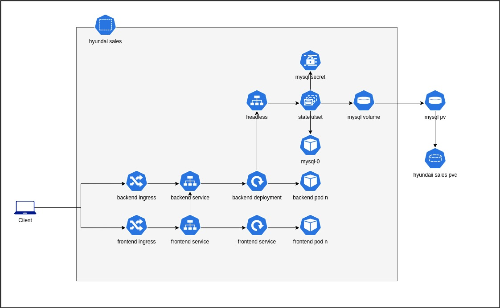

# Kubernetes Documentation

## Overview

This document provides details on the Kubernetes deployment phase of the project. The project is deployed on a **Kind (Kubernetes IN Docker)** cluster, which simulates a Kubernetes environment. It consists of **one master node** and **two worker nodes**. 

The deployment includes the following components:
- **MySQL**: Deployed as a StatefulSet to ensure persistent storage and stable identities.
- **Backend**: Deployed as a standard Kubernetes Deployment with an exposed service for communication.
- **Frontend**: Similar to the backend, deployed as a Deployment, exposed via an Ingress resource for external access.
- **Ingress**: Configured to allow external access to the resources inside the cluster securely using TLS certificates.

The setup is designed for development and testing, leveraging Kubernetes' features like StatefulSets, Deployments, and Ingress to ensure easy management and scalability of services.

## Architecture
The architecture of this Kubernetes deployment is designed to ensure scalability, reliability, and secure communication between services. It leverages Kubernetes' core features such as Deployments, StatefulSets, and Ingress to manage the lifecycle of applications and provide seamless access to users.

Below is a high-level architecture diagram illustrating the components and their interactions within the Kubernetes cluster:



This architecture provides a robust framework for deploying and managing the project in a Kubernetes environment. By utilizing Kubernetes' features, the deployment ensures that the services are scalable, maintainable, and secure, making it suitable for both development and production environments.

## Folder Structure

The directory structure for the Kubernetes deployment is organized as follows:

```
├── backend
│   ├── config-map.yaml       # Configuration map for backend services
│   ├── deployment.yaml       # Deployment configuration for backend
│   ├── ingress.yaml          # Ingress configuration for backend access
│   ├── service.yaml          # Service definition for backend
│   ├── tls.crt               # TLS certificate for secure communication
│   └── tls.key               # TLS key for secure communication
├── cluster
│   ├── build.sh              # Script to build the Kubernetes resources
│   ├── destroy.sh            # Script to destroy the Kubernetes resources
│   └── kind-config.yaml      # Kind configuration file for setting up the cluster
├── frontend
│   ├── deployment.yaml       # Deployment configuration for frontend
│   ├── ingress.yaml          # Ingress configuration for frontend access
│   ├── service.yaml          # Service definition for frontend
│   ├── tls.crt               # TLS certificate for secure communication
│   └── tls.key               # TLS key for secure communication
├── mysql
│   ├── config-map.yaml       # Configuration map for MySQL service
│   ├── headless.yaml         # Headless service for MySQL StatefulSet
│   ├── init.sql              # SQL script for initializing the MySQL database
│   ├── secret.sh             # Script to create secrets for MySQL credentials
│   └── statefulset.yaml      # StatefulSet configuration for MySQL deployment
└── tls.sh                    # Script to generate TLS certificates
```

### Key Components

#### 1. MySQL StatefulSet

- **StatefulSet**: This ensures that the MySQL pods have stable and unique network identities, which is crucial for databases that require persistent storage.
- **Headless Service**: Used for creating a stable DNS name for MySQL pods, allowing direct access to each instance. This is especially important for the StatefulSet to manage persistent storage properly.
- **init.sql**: This SQL script is executed when the MySQL container starts, setting up the necessary schemas or default data in the database.

#### 2. Backend Deployment

- **Deployment**: The backend application is deployed as a Kubernetes Deployment, which manages the pods and ensures the specified number of replicas are always running.
- **Ingress**: An Ingress resource is created to expose the backend service externally, enabling access from outside the Kubernetes cluster. It is also configured with **TLS** for secure communication.
- **Service**: Defines a stable internal endpoint for the backend application, allowing other services to communicate with it inside the cluster.

#### 3. Frontend Deployment

- **Deployment**: The frontend application is also deployed as a Kubernetes Deployment, similar to the backend, ensuring scalability and availability.
- **Ingress**: Exposes the frontend to the outside world, allowing users to interact with the application via HTTPS.
- **Service**: Defines the internal service for the frontend, enabling communication between different parts of the application.

#### 4. TLS Certificates

- **tls.crt & tls.key**: These are the certificates and keys used to secure communication between the frontend, backend, and external users. The Ingress controller is configured to use these certificates for HTTPS access to the services.

## Cluster Setup

This project utilizes **Kind** (Kubernetes in Docker) to set up the Kubernetes cluster. This environment allows testing and development without requiring a full cloud-based Kubernetes infrastructure. The cluster consists of:

- **1 Master Node**: Handles the control plane and scheduling of workloads.
- **2 Worker Nodes**: Responsible for running the services (MySQL, backend, frontend).

### Cluster Configuration

The **Kind** cluster is configured using the `kind-config.yaml` file. This file specifies the cluster setup, including the number of nodes and any special configurations for the cluster. Scripts to build and destroy the cluster are located in the `cluster` directory (`build.sh` and `destroy.sh`).

## Setting Up the Cluster

Follow these steps to set up and manage the Kubernetes resources for this project:

### 1. Create the Cluster

To create the Kubernetes cluster using **Kind**, run the following script from the `cluster` directory:

```bash
$ ./build.sh
```

This script will:
- Use the `kind-config.yaml` to create the cluster with 1 master and 2 worker nodes.
- Set up Docker containers to simulate Kubernetes nodes on your local machine.

### 2. Deploy the Resources

Once the cluster is up and running, deploy the Kubernetes manifests for MySQL, backend, and frontend:

```bash
$ kubectl apply -f <file-path>
```

You will need to apply the following manifests:
- **Backend**: `backend/deployment.yaml`, `backend/service.yaml`, `backend/ingress.yaml`
- **Frontend**: `frontend/deployment.yaml`, `frontend/service.yaml`, `frontend/ingress.yaml`
- **MySQL**: `mysql/config-map.yaml`, `mysql/headless.yaml`, `mysql/statefulset.yaml`

### 3. Access the Services

To access the services from outside the cluster, you must configure the **Ingress**. After deploying the Ingress resources, ensure that your DNS or `/etc/hosts` file is properly configured for local access.

#### Example for Ubuntu:

Edit your `/etc/hosts` file and add the following entries:

```bash
127.0.0.1 hyundai-sales.local
127.0.0.1 api.hyundai-sales.local
```

This will allow you to access the frontend and backend services locally using `hyundai-sales.local` and `api.hyundai-sales.local` URLs.

### 4. Destroy the Cluster

When you're done with the deployment and want to tear down the cluster, run the following script to delete the Kind cluster:

```bash
$ ./destroy.sh
```

This script will clean up all Kubernetes resources and remove the cluster entirely.

## Troubleshooting

If you encounter issues, ensure the following:
- The **Ingress controller** is properly configured to handle TLS certificates.
- DNS entries in `/etc/hosts` or your DNS provider are pointing to the correct local addresses.
- Check the Kubernetes pods and services with `kubectl get pods`, `kubectl get svc`, and `kubectl describe ingress` for detailed status information.

## Conclusion

This Kubernetes deployment provides a reliable environment to run the project with persistent storage for MySQL, scalable backend and frontend services, and secure communication through TLS. The use of Kind simplifies the process of managing the cluster locally, making it ideal for development and testing purposes.
